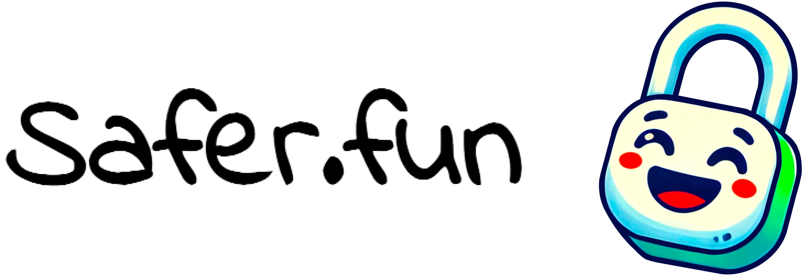
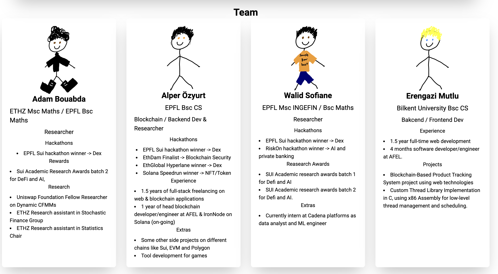
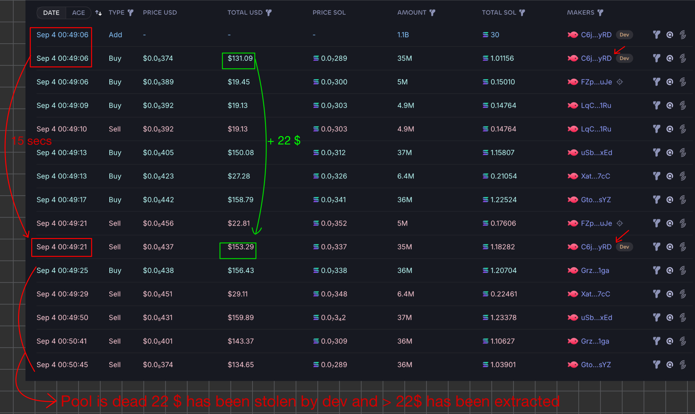
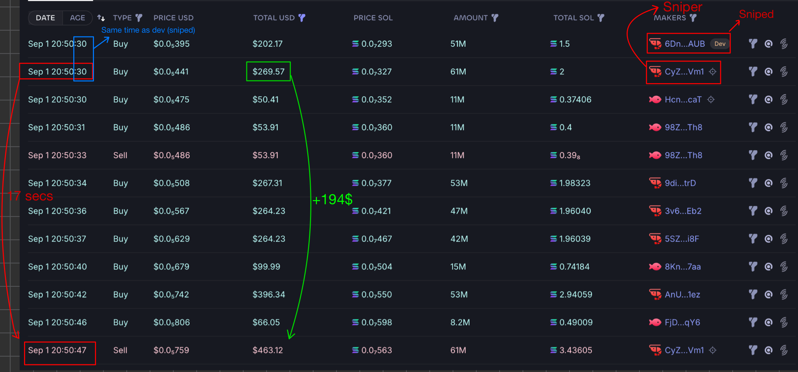
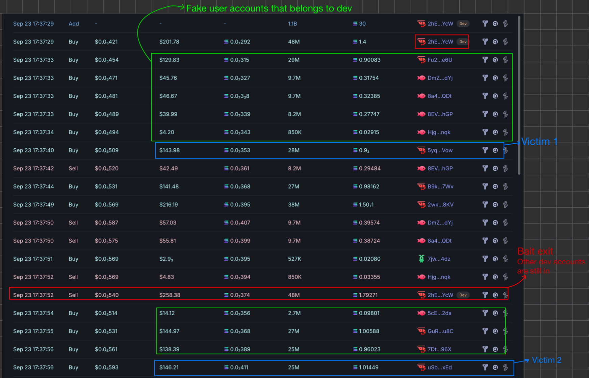
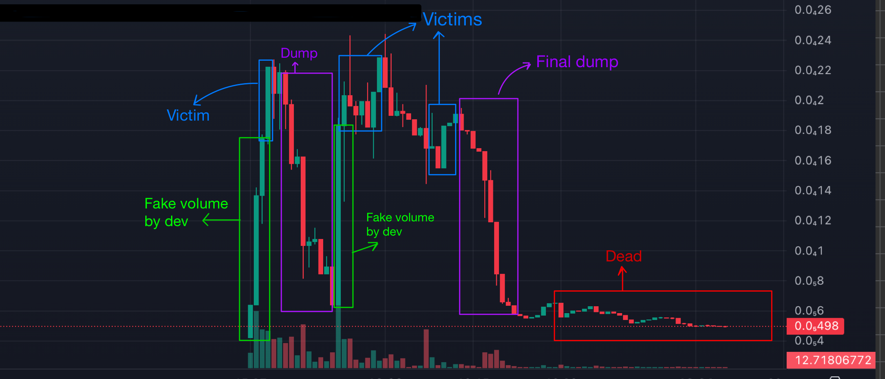

*Safer.fun is a platform-agnostic protocol enhancing fairness in the memecoin market by introducing unique ways of randomness and auctions. It combats malicious actors like snipers and unethical developers, preventing systematic, risk-free wins. It ensures equitable token launches and fair allocation for buyers, improving user experience across any platform or DEX.*

**[Live Demo Website](https://saferfun.vercel.app/)**

**[Presentation](https://youtu.be/kYnOp-JzL88)**

# App Structure

**[Backend](backend/) :** We use Nest.js in order to handle non-important functionalty eg. posting comments. This is not an obligation for solana program of Safer.fun

**[Frontend](frontend/) :** We used Next.js and web-3 libraries to create current frontend in order to provide best UI and UX

**[Simulations](simulations/) :** A monte carlo simulation of types of rugpulls in a classical pump.fun like_pool as well as a one for a mock safer.fun.

**[Solana Program](solana-program/) :** We use [clockwork](https://docs.clockwork.xyz/) to handle worker-like time based functionality on distribution phase. We use VRF to introduce randomness on clockwork calls

Each part of app has their own Readme file you can check them by browsing in folders for additional information

# Team

# How To Calculate Auction Score

# How Do We Do

# Exploit Examples

