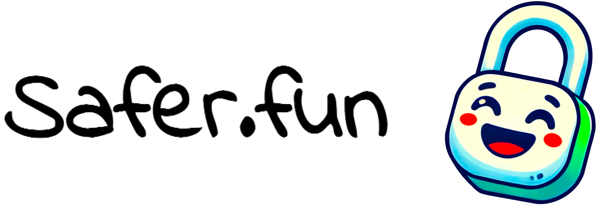
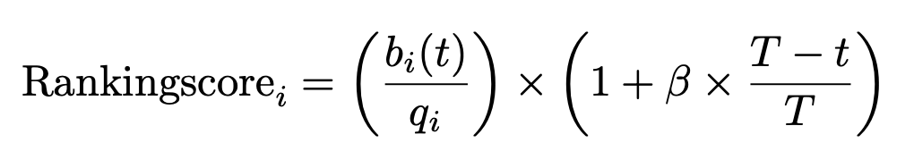
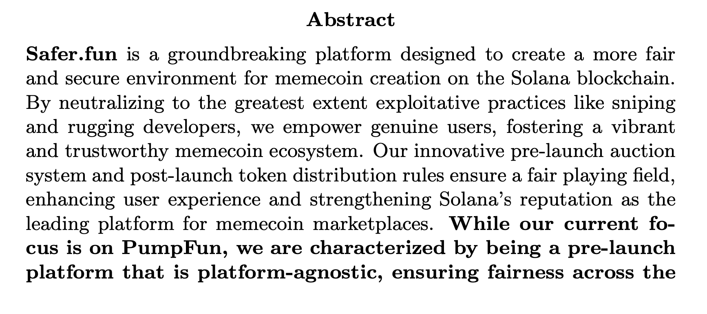
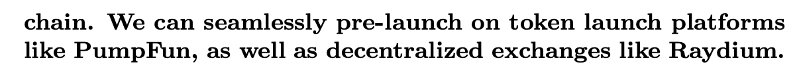

*Safer.fun is a platform-agnostic protocol enhancing fairness in the memecoin market by introducing unique way of randomness and auctions. It combats malicious actors like snipers and unethical developers, preventing systematic, risk-free wins. It ensures equitable token launches and fair allocation for buyers, improving user experience across any platform or DEX.*

# App Structure

**[Backend](backend/) :** We use Nest.js in order to handle non-important functionalty eg. posting comments. This is not an obligation for solana program of Safer.fun

**[Simulations](simulations/) :** A monte carlo simulation of types of rugpulls in a classical pump.fun like_pool as well as a one for a mock safer.fun. 

**[Solana Program](solana-program/) :** We use [clockwork](https://docs.clockwork.xyz/) to handle worker-like functionalty on distribution phase. We use VRF to introduce randomness on clockwork calls 

# How To Calculate Auction Score

# How Do We Do

# Exploit Examples

